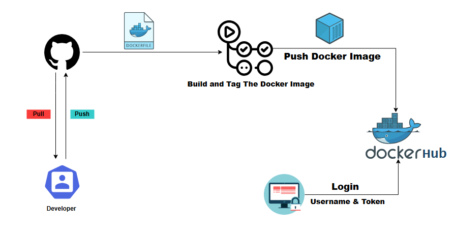

# Automating Builds and Pushes to Docker Hub with GitHub Actions

A CI/CD pipeline that automatically builds a Docker image from a Node.js app and pushes it to Docker Hub on every `git push` using GitHub Actions.

---

## Project Structure

```
├── .github/
│   └── workflows/
│       └── pushImage.yml       # GitHub Actions workflow
├── DockerFileFolder/
│   ├── Dockerfile              # Docker image definition
│   └── package.json            # Node.js app manifest
└── A.png                       # Architecture/flow diagram
```

---

## How It Works

1. Developer pushes code to any branch.
2. GitHub Actions triggers the `pushImage.yml` workflow.
3. The workflow:
   - Checks out the repository.
   - Logs in to Docker Hub using stored secrets.
   - Builds the Docker image from `DockerFileFolder/`.
   - Pushes the image to Docker Hub with the `latest` tag.

---

## Tech Stack

| Technology      | Purpose                          |
|-----------------|----------------------------------|
| Node.js 14      | Application runtime              |
| Express 4.x     | Web framework                    |
| Docker          | Containerization                 |
| GitHub Actions  | CI/CD automation                 |
| Docker Hub      | Container image registry         |

---

## Application Details

- Entry point: `index.js`
- Exposed port: `3000`
- Dependencies: `express ^4.17.1`, `config ^3.3.6`

---

## GitHub Actions Workflow (`pushImage.yml`)

```yaml
on: push   # Triggers on every push to any branch
```

The workflow runs on `ubuntu-latest` and uses:
- `actions/checkout@v3` — to clone the repo
- `docker/login-action@v2` — to authenticate with Docker Hub
- `docker/build-push-action@v4` — to build and push the image

Docker Hub image tag: `ashrafbilalmohaidat/pushdockerimage:latest`

---

## Setup & Configuration

### 1. Fork / Clone the Repository

```bash
git clone https://github.com/<your-username>/Automating-Builds-and-Pushes-to-Docker-Hub-with-Github-Actions.git
```

### 2. Add GitHub Secrets

Go to your repository → **Settings** → **Secrets and variables** → **Actions** and add:

| Secret Name        | Value                          |
|--------------------|--------------------------------|
| `DOCKER_USERNAME`  | Your Docker Hub username       |
| `DOCKERHUB_TOKEN`  | Your Docker Hub access token   |

> Use a Docker Hub **Access Token** (not your password) for better security.

### 3. Push to Trigger the Pipeline

```bash
git add .
git commit -m "trigger build"
git push
```

The workflow will automatically build and push the image to Docker Hub.

---

## Running Locally

```bash
# Build the image
docker build -t docker_nodejs_demo ./DockerFileFolder

# Run the container
docker run -p 3000:3000 docker_nodejs_demo
```

App will be available at `http://localhost:3000`

---

## Architecture Diagram


